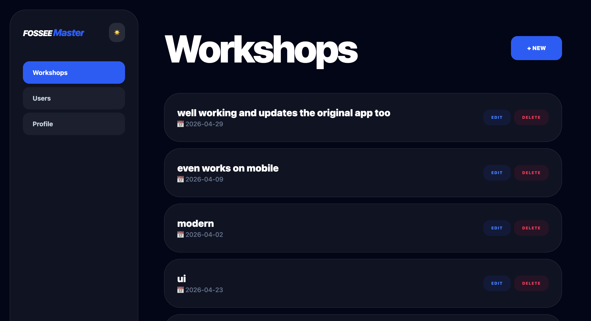

# FOSSEE Workshop Portal. Submission by Sourav

I worked on the FOSSEE Python Screening Task. I did not just fix the CSS. I rebuilt the interface to make it feel like a dashboard that a coordinator would want to use every day. The FOSSEE Workshop Portal is now very user friendly.

I used Django Ninja and React to make the FOSSEE Workshop Portal work well on phones and big monitors. The FOSSEE Workshop Portal works great on all devices.

---

## Visuals

I have some pictures of the dashboard in the screenshots folder.

The FOSSEE Workshop Portal has a Glassmorphic UI with a dark mode toggle.

---

## My Thought Process and Development Notes

### 1. Making it Work on Mobile

admin portals do not work well on mobile devices. I wanted the FOSSEE Workshop Portal to work well on mobile.

* I moved the menu to the top on devices so it is easy to use.

* I made the buttons big so they are easy to click.

### 2. Fixing the Database Problem

I had some issues with the FOSSEE Django models. If a user tried to add a workshop with a topic the database would throw an error.

* I fixed this by adding a get or create logic in the api. The FOSSEE Workshop Portal can now handle topics without errors.

### 3. Design and Performance

I used a design for the FOSSEE Workshop Portal.

* It looks very nice.

*. It can be slow on old phones. I used utility classes to keep it fast.

### 4. Security and Profile Sync

I added a security tab to the FOSSEE Workshop Portal.

* Users can reset passwords from the UI.

* I also added a profile tab that syncs user information across the app.

---

## Setup and Launch

1. **The Backend**:
   - Install dependencies: `pip install -r requirements.txt`
   - Start the engine: `python manage.py runserver`

2. **The Frontend**:
   - `cd` into the frontend folder.
   - Install & Run: `npm install && npm run dev`

---

## 🛡️ License & Copyright
This project was developed by **SouravGoswami** as part of the FOSSEE Python Screening Task. 
The original UI and logic enhancements (Glassmorphism, Mobile-first navigation, 
and Django Ninja integration) are the intellectual property of the author. 
Distributed under the MIT License.

---

## Final Thoughts

I did not just move buttons around. I made the FOSSEE Workshop Portal feel fast and secure. I am proud of how the FOSSEE Workshop Portal handles data without crashing. The FOSSEE Workshop Portal is ready, for the future.
